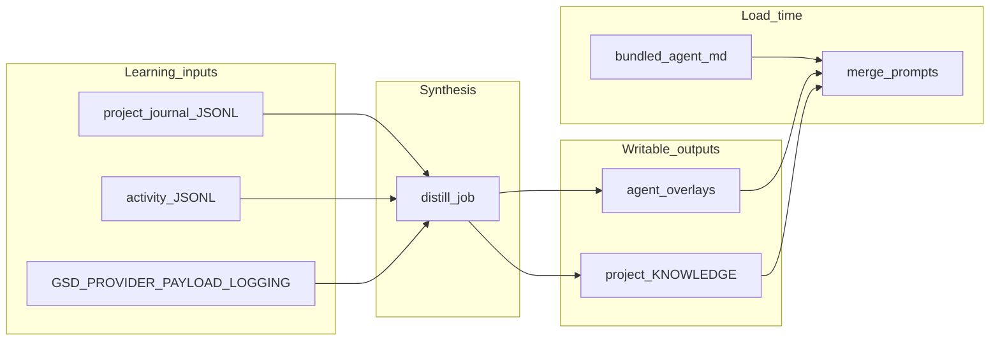
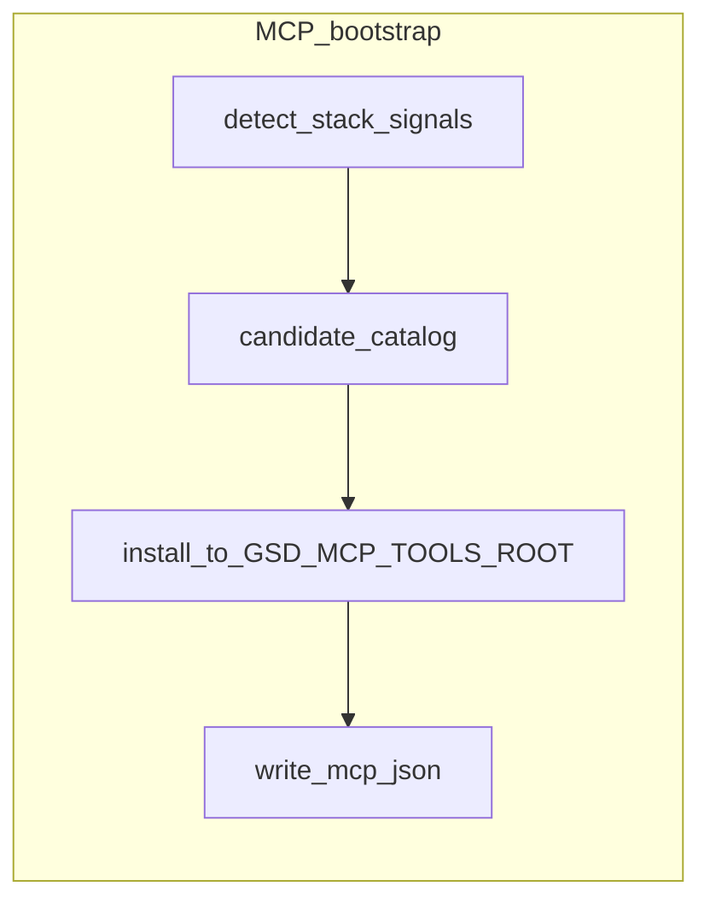

# GSD capability expansion (phased + five-layer test coverage)

## Scope consolidated from prior discussion

- **`gsd research` / `/gsd research`**: headless or slash entry that reuses existing **`research-milestone` / `research-slice`** dispatch and writes **`Mxxx-RESEARCH.md`** / **`Sxx-RESEARCH.md`** ([`src/resources/extensions/gsd/auto-dispatch.ts`](src/resources/extensions/gsd/auto-dispatch.ts), [`src/resources/extensions/gsd/paths.ts`](src/resources/extensions/gsd/paths.ts), [`src/resources/extensions/gsd/auto-prompts.ts`](src/resources/extensions/gsd/auto-prompts.ts)).
- **Optional `--mcp <server>`**: invoke configured MCP via existing client ([`src/resources/extensions/mcp-client/index.ts`](src/resources/extensions/mcp-client/index.ts)); merge output into research doc (section + frontmatter metadata).
- **MCP “bootstrap”**: discover candidate servers for the repo and materialize under a **configurable root** (default via env e.g. `GSD_MCP_TOOLS_ROOT`, not a hardcoded user path); update **`.mcp.json`** or **`.gsd/mcp.json`** with reviewed entries.
- **CI/CD inside change pipeline**: extend preferences/hooks or add **`run`-type hook steps** (shell + timeout) alongside today’s prompt-only [`post_unit_hooks` / `pre_dispatch_hooks`](docs/configuration.md) ([`src/resources/extensions/gsd/rule-registry.ts`](src/resources/extensions/gsd/rule-registry.ts), [`src/resources/extensions/gsd/post-unit-hooks.ts`](src/resources/extensions/gsd/post-unit-hooks.ts), [`src/resources/extensions/gsd/auto/phases.ts`](src/resources/extensions/gsd/auto/phases.ts)).
- **Learning / agent improvement**: **do not mutate** synced [`~/.gsd/agent/agents/`](src/resource-loader.ts); add **overlay merge** at load time + optional synthesis job inputs from [`.gsd/journal/`](src/resources/extensions/gsd/journal.ts) + [`.gsd/activity/*.jsonl`](src/resources/extensions/gsd/activity-log.ts) (+ optional redacted payload log hook).
- **Sandbox UX**: document and align **Docker** ([`docker/README.md`](docker/README.md)) with **subagent isolation** ([`src/resources/extensions/subagent/isolation.ts`](src/resources/extensions/subagent/isolation.ts)); prefs flag for “preferred execution lane” where feasible without rewriting the whole executor.
- **SpecKit / OpenSpec**: **bootstrap-only** in-repo artifacts (`npx` init + committed templates + short maintainer doc)—no deep GSD codegen in early phases.
- **Bedrock `getAvailable` gap**: default AWS credential chain without `AWS_PROFILE` ([`packages/pi-ai/src/env-api-keys.ts`](packages/pi-ai/src/env-api-keys.ts) ~102–119) so `--list-models` shows `amazon-bedrock` when the SDK would authenticate.

## Environment variable contract (aligned with [.env](.env))

Implementation **must read, document, and test** the names below. Boolean parsing for `GSD_*` flags: treat `1`, `true`, `yes` (case-insensitive) as enabled; anything else (including typos like `trues`) as **disabled**, and log a one-line warning once when the value is non-empty but not recognized—so misconfiguration is visible.

### GSD-prefixed (feature flags and paths)

| Variable | Phase | Required behavior |
|----------|--------|-------------------|
| **`GSD_BEDROCK_ASSUME_DEFAULT_CREDS`** | P0 | When truthy, `amazon-bedrock` is considered authenticated for `hasAuth` / `getAvailable` if default AWS shared config files exist under `HOME` (exact rules in ADR inline comment). Does not remove need for real AWS creds at request time. |
| **`GSD_MCP_TOOLS_ROOT`** | P3 | Absolute path root for `mcp bootstrap --apply` materialization; if unset, bootstrap command errors with a clear message (no silent default to a user home path). |
| **`GSD_DOCKER_SMOKE`** | P5 / CI | When truthy, enable optional Docker sandbox build/smoke in CI or local scripts; default CI stays fast when unset/false. |
| **`GSD_SHELL_HOOKS_ENABLED`** | P2 | When **not** truthy, **`run`-type shell hooks never execute** (parse-only / no-op), even if prefs define them—security default matches “opt-in”. |
| **`GSD_LEARN_OVERLAY_DIR`** | P4 | When set, synthesis + merge read/write overlays under this directory (user-owned); when unset, fall back to `~/.gsd/agent/agents/overlays/` (or documented default). |
| **`GSD_PROVIDER_PAYLOAD_LOGGING`** | P4 | When truthy, append **redacted** provider request/response traces to a project or global log path (document exact file naming in `docs/configuration.md`); when false, zero overhead path (no file IO). |

### Provider and app keys (passthrough — existing functionality)

These appear in [.env](.env) for **this monorepo**; GSD work **must not** break their consumers.

| Variable | Role in plan |
|----------|----------------|
| **`GROQ_API_KEY`** | Already used by Pi/GSD for Groq models ([`packages/pi-ai/src/env-api-keys.ts`](packages/pi-ai/src/env-api-keys.ts)). Regression: `hasAuth`/`getApiKey` for `groq` unchanged unless explicitly tested and documented. |
| **`E2B_API_KEY`** | P5: optional **E2B ephemeral sandbox** execution lane (alongside Docker + overlay). When set, document how to enable `execution.isolation: e2b` (or equivalent); when unset, E2B code paths dormant. No hard dependency on E2B for core GSD. |
| **`STRIPE_SECRET_KEY`**, **`VERCEL_API_TOKEN`**, **`VITE_LAUNCHDARKLY_SDK_KEY`**, **`VITE_SUPABASE_URL`**, **`VITE_SUPABASE_ANON_KEY`** | Consumed by **studio/web** or other tooling, not core CLI. Regression: do not filter `process.env` when spawning child processes or starting web host; Vite `import.meta.env` continues to receive `VITE_*` as today. |

## Regression and non-breaking requirements

- **Full existing test suite** (`npm test`, `test:coverage` where CI enforces) stays **green** at each phase merge; add new suites, do not weaken existing assertions without migration note.
- **No removal** of existing env resolution for LLM providers (Anthropic, OpenAI, Groq, Bedrock chain, etc.) except additive Bedrock discovery behind `GSD_BEDROCK_ASSUME_DEFAULT_CREDS`.
- **Subagent / auto / MCP client** behavior without new env vars must match pre-change semantics (golden or snapshot tests where fragile).
- **Web/studio**: smoke or integration test that build/dev still sees `VITE_*` when present (or document manual check in P5 checklist if no automated harness yet).

## Architecture (high level)

## Phased delivery (each phase merges independently)

### Phase P0 — Bedrock auth discovery + tests

- **Change**: Implement **`GSD_BEDROCK_ASSUME_DEFAULT_CREDS`** as specified in [Environment variable contract](#environment-variable-contract-aligned-with-env). Extend `getEnvApiKey("amazon-bedrock")` / `hasAuth` when flag is truthy—without async network I/O in hot path (detect shared credential files under `HOME`).
- **Tests (all five layers)**: See [Mandatory test matrix](#mandatory-test-matrix-per-phase) row **P0**.

### Phase P1 — `gsd research` + MCP merge + tests

- **CLI**: Early branch in [`src/cli.ts`](src/cli.ts) mirroring `worktree` / `config` for `gsd research [args]` calling a new [`src/research-cli.ts`](src/research-cli.ts) (or under `src/resources/extensions/gsd/`).
- **Slash**: Register `research` in [`src/resources/extensions/gsd/commands/catalog.ts`](src/resources/extensions/gsd/commands/catalog.ts), dispatch in [`handlers/core.ts`](src/resources/extensions/gsd/commands/handlers/core.ts) or ops, reuse auto research dispatch via shared helper extracted from [`guided-flow.ts`](src/resources/extensions/gsd/guided-flow.ts) / [`auto-dispatch.ts`](src/resources/extensions/gsd/auto-dispatch.ts).
- **MCP**: `--mcp name` → load config from same paths as [`mcp-client`](src/resources/extensions/mcp-client/index.ts); call tool(s) via internal programmatic API (factor small `callMcpTool` helper for tests).
- **Tests (all five layers)**: See matrix row **P1**.

### Phase P2 — Shell CI hooks + tests

- **Schema**: Extend preferences types in [`src/resources/extensions/gsd/preferences-types.ts`](src/resources/extensions/gsd/preferences-types.ts) + validation in [`preferences-validation.ts`](src/resources/extensions/gsd/preferences-validation.ts) for e.g. `pre_dispatch_hooks[].run: { command, args?, cwd?, timeoutMs? }` **or** separate `ci_hooks` list to avoid overloading `modify/skip/replace`.
- **Execution**: Implement runner using `child_process.spawn` with timeout, capture stdout/stderr caps, surface failure as **unit failure** or **journal `guard-block`** (decide in design: fail-fast vs notify-only); wire from [`runPreDispatchHooks`](src/resources/extensions/gsd/post-unit-hooks.ts) / post-unit path in [`auto-post-unit.ts`](src/resources/extensions/gsd/auto-post-unit.ts) / [`auto/phases.ts`](src/resources/extensions/gsd/auto/phases.ts).
- **Gate**: Shell `run` steps execute **only** when **`GSD_SHELL_HOOKS_ENABLED`** is truthy; otherwise skip execution and emit a single debug-level notice on first skip per session (test both branches).
- **Tests (all five layers)**: See matrix row **P2**.

### Phase P3 — MCP bootstrap (`GSD_MCP_TOOLS_ROOT`) + tests

- **Catalog**: Curated JSON in-repo (e.g. [`src/resources/extensions/gsd/data/mcp-catalog.json`](src/resources/extensions/gsd/data/mcp-catalog.json)) mapping **stack signals** (from [`detection.ts`](src/resources/extensions/gsd/detection.ts) / `package.json` deps / Dockerfile) → recommended MCP packages/repos.
- **Command**: `/gsd mcp bootstrap` + `gsd mcp bootstrap` (ops handler) → dry-run plan, `--apply` requires **`GSD_MCP_TOOLS_ROOT`** set to an absolute path (same semantics as [.env](.env) example), writes under that root, merges JSON into `.mcp.json` with **absolute** `command`/`args`.
- **Safety**: default dry-run; `--apply` requires confirmation in TUI; non-interactive requires `--yes`.
- **Tests (all five layers)**: See matrix row **P3**.

### Phase P4 — Learning overlays + synthesis job + tests

- **Storage**: Overlays live under **`GSD_LEARN_OVERLAY_DIR`** when set, else default `~/.gsd/agent/agents/overlays/<agent>.md` (or single `LEARNED.md` with sections); **user-owned**; never touched by [`initResources`](src/resource-loader.ts) sync.
- **Merge**: Hook subagent / agent prompt resolution (locate loader for agent markdown—likely [`subagent`](src/resources/extensions/subagent/) or resource paths) to append overlay after bundled file read.
- **Synthesis**: Background or `/gsd learn apply` job: read journal + latest activity tail; when **`GSD_PROVIDER_PAYLOAD_LOGGING`** is truthy, include **redacted** excerpts from the payload log in synthesis input (never raw secrets); call small model to propose **unified diff** to overlay + optional `.gsd/KNOWLEDGE.md` snippets; require explicit apply.
- **Tests (all five layers)**: See matrix row **P4**.

### Phase P5 — Sandbox UX + SpecKit/OpenSpec bootstrap + tests

- **Sandbox**: Add prefs doc + `doctor` check linking Docker template, subagent overlay isolation, and **optional E2B** when **`E2B_API_KEY`** is set; enum `execution.isolation: host|overlay|docker|e2b` (or equivalent) with **documentation + warnings** first, then executor integration if low-risk. **`GSD_DOCKER_SMOKE`** controls optional Docker build/smoke in test/CI scripts as in [Environment variable contract](#environment-variable-contract-aligned-with-env).
- **SpecKit/OpenSpec**: Run init in [`docs/`](docs/) or `.spec/` / `openspec/` at repo root; add [`docs/contributing-meta-specs.md`](docs/contributing-meta-specs.md) mapping to `.gsd/`; **no** runtime dependency in GSD binary.
- **Tests (all five layers)**: See matrix row **P5**.

## Mandatory test matrix (per phase)

**Definition of done**: Each phase **P0–P5** must add or extend tests in **all** of the following layers. CI **fails** if any layer is missing for that phase’s deliverables.

**Env contract tests**: Add unit tests for shared **boolean env parsing** (`true`/`1`/`yes` vs invalid `trues`); integration tests proving **`GROQ_API_KEY`** still resolves when other `GSD_*` flags toggle; optional web smoke that **`VITE_*`** keys are not stripped from dev server env when P5 touches process spawning.

| Layer | What it means in this repo | Tooling / location |
|--------|----------------------------|-------------------|
| **Unit** | Pure functions, validators, parsers, merge order, redaction, env resolution | `node:test` alongside source or under `**/tests/*.test.ts` (existing pattern: [`packages/pi-ai`](packages/pi-ai), [`src/resources/extensions/gsd/tests`](src/resources/extensions/gsd/tests)) |
| **Integration** | Multiple real modules + temp filesystem (`mkdtemp`), stubbed `spawn`/MCP/HTTP, no production keys | Same runner; reuse patterns from [`src/resources/extensions/gsd/tests`](src/resources/extensions/gsd/tests), [`src/tests/integration`](src/tests/integration) |
| **E2E** | Black-box **subprocess**: real `node dist/loader.js` (or packaged `gsd`) against fixture repo; assert exit code + files + stdout/stderr | Extend [`tests/smoke`](tests/smoke), [`tests/live`](tests/live) (gated env), or new `tests/e2e/*.ts`; optional Playwright only where the feature is **web**-surfaced (align with [`src/tests/integration/web-mode-runtime-harness.ts`](src/tests/integration/web-mode-runtime-harness.ts)) |
| **BDD** | Executable **Gherkin**: `.feature` + step definitions that call the same public APIs/CLI as E2E | Add **`@cucumber/cucumber`** (or equivalent) as **devDependency**; features under `tests/bdd/features/`, steps under `tests/bdd/steps/`; **one feature file minimum per phase** covering the primary user story for that phase |
| **Property-based (“Hypothesis”)** | Invariants fuzzed over generated inputs (Python Hypothesis analogue: **`fast-check`**) | Add **`fast-check`** as **devDependency**; property tests co-located with unit tests or `*.property.test.ts`; **at least one property** per phase on the riskiest pure logic (merge, catalog match, redaction, hook timeout math, JSON patch idempotence) |

### Per-phase minimum examples (customize filenames during implementation)

| Phase | Unit | Integration | E2E | BDD feature (example title) | Property-based (example invariant) |
|-------|------|-------------|-----|------------------------------|--------------------------------------|
| **P0** | `getEnvApiKey` / `hasAuth` with `HOME` fixture | `ModelRegistry.getAvailable()` with temp auth + models | `gsd --list-models bedrock` subprocess with env | `Bedrock models appear when default AWS config exists` | For arbitrary synthetic `HOME` trees (generator), auth classification matches spec |
| **P1** | arg parser, MCP merge section | temp `.gsd` + mock MCP client writes `M001-RESEARCH.md` | `gsd --mode text … research` or dedicated `gsd research` on fixture | `Research command produces milestone research artifact` | merged markdown always contains valid frontmatter keys when MCP returns JSON |
| **P2** | hook runner timeout/exit | prefs YAML load + hook fires in dispatch pipeline stub | subprocess: prefs + minimal auto loop or `run-hook` if exposed | `Pre-dispatch shell hook blocks failing CI command` | truncated stdout never exceeds configured cap for random chunk sizes |
| **P3** | catalog matcher | `.mcp.json` merge idempotence on disk | `gsd mcp bootstrap --dry-run` on fixture repo | `Bootstrap dry-run lists candidates for a Node project` | merged `mcpServers` keys remain unique for random server name permutations |
| **P4** | overlay merge order, redaction | synthesis stub + filesystem | `gsd learn` (or equivalent) dry-run on fixture | `Applying learning proposal updates overlay only after confirm` | redacted text never contains sampled secret substrings |
| **P5** | prefs validation for isolation enum | doctor check with temp project | optional `docker build` behind `GSD_DOCKER_SMOKE=1` | `Doctor reports sandbox guidance when Docker missing` | random invalid isolation strings always rejected by validator |

## Tooling and CI wiring

- Add **devDependencies**: `fast-check`, `@cucumber/cucumber` (pin versions in root [`package.json`](package.json)).
- Add **npm scripts** (names illustrative): `test:bdd` → `cucumber-js`, `test:property` → run `*.property.test.ts` via existing node test runner or a small glob script; merge into **`test`** so default CI runs **unit + integration + e2e (non-live) + bdd + property**.
- **E2E cost**: keep default E2E **fast** (fixture repos &lt; 100ms setup); mark slow Docker E2E optional via env flag.
- **Coverage**: extend existing **c8** thresholds in [`package.json`](package.json) `test:coverage` for new packages touched, or add scoped coverage for `tests/bdd` / property files—do not regress global gates.

## Cross-cutting notes (non-test)

- **Smoke (optional)**: `docker build -f docker/Dockerfile.sandbox` remains **nightly** or `GSD_DOCKER_SMOKE=1`—supplements E2E, does not replace BDD/property requirements.

## Documentation touchpoints

- [`docs/configuration.md`](docs/configuration.md): full table of **all `GSD_*` vars** from [Environment variable contract](#environment-variable-contract-aligned-with-env); MCP paths; shell-hook gate; `GSD_MCP_TOOLS_ROOT`; `GSD_LEARN_OVERLAY_DIR`; `GSD_PROVIDER_PAYLOAD_LOGGING`; `GSD_DOCKER_SMOKE`; optional E2B + `E2B_API_KEY`; note that **`GROQ_API_KEY`** and **`VITE_*`** / Stripe / Vercel are passthrough for existing features.
- [`docs/commands.md`](docs/commands.md): `research`, `mcp bootstrap`, `learn`.
- [`README.md`](README.md): short “Development meta” link; pointer to `.env.example` listing names **without secrets**.

## Risk notes

- **Shell hooks** are security-sensitive—**`GSD_SHELL_HOOKS_ENABLED`** is mandatory opt-in before any `spawn` from hook definitions.
- **MCP bootstrap** must not auto-run arbitrary installs without `--yes` and catalog signing/review.
- **Learning** must redact secrets and avoid overwriting bundled agents.
