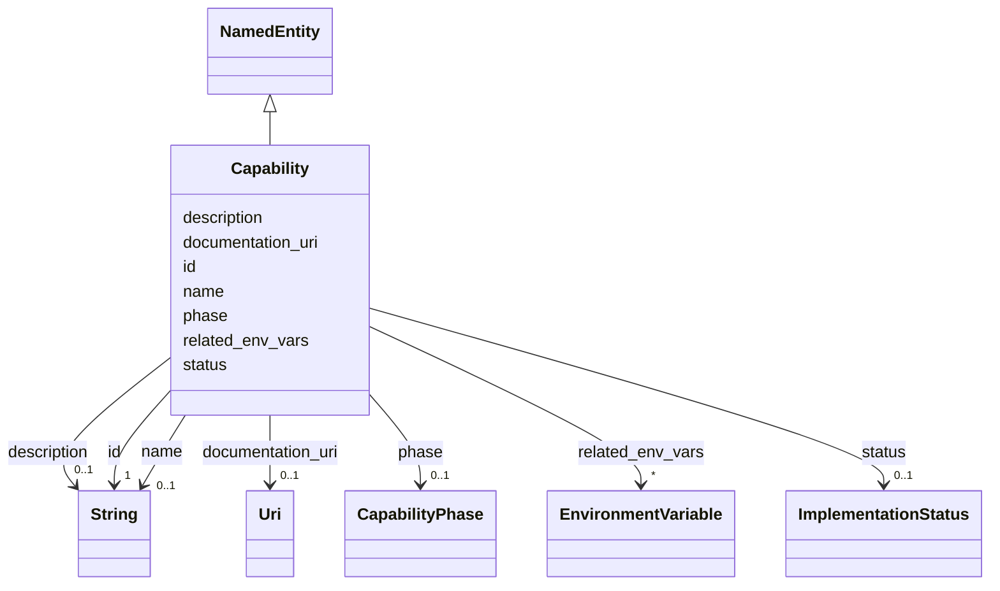

# Class: Capability 


_A discrete product or CLI capability (e.g. Bedrock discovery, research CLI)._


URI: [gsd:Capability](https://brightforest.dev/schema/gsd_capabilities/Capability)





## Inheritance
* [NamedEntity](NamedEntity.md)
    * **Capability**


## Slots

| Name | Cardinality and Range | Description | Inheritance |
| ---  | --- | --- | --- |
| [phase](phase.md) | 0..1 <br/> [CapabilityPhase](CapabilityPhase.md) | Planning / delivery phase bucket (P0–P5). | direct |
| [status](status.md) | 0..1 <br/> [ImplementationStatus](ImplementationStatus.md) | Lifecycle state of the capability. | direct |
| [related_env_vars](related_env_vars.md) | * <br/> [EnvironmentVariable](EnvironmentVariable.md) | Env vars that gate or configure this capability. | direct |
| [documentation_uri](documentation_uri.md) | 0..1 <br/> [xsd:anyURI](http://www.w3.org/2001/XMLSchema#anyURI) | Link to maintainer or user documentation. | direct |
| [id](id.md) | 1 <br/> [xsd:string](http://www.w3.org/2001/XMLSchema#string) | Stable URI or CURIE-style id for the instance. | [NamedEntity](NamedEntity.md) |
| [name](name.md) | 0..1 <br/> [xsd:string](http://www.w3.org/2001/XMLSchema#string) | Short human-readable name. | [NamedEntity](NamedEntity.md) |
| [description](description.md) | 0..1 <br/> [xsd:string](http://www.w3.org/2001/XMLSchema#string) | Longer prose description. | [NamedEntity](NamedEntity.md) |


## Identifier and Mapping Information


### Schema Source


* from schema: https://brightforest.dev/schema/gsd_capabilities


## Mappings

| Mapping Type | Mapped Value |
| ---  | ---  |
| self | gsd:Capability |
| native | gsd:Capability |


## LinkML Source

<!-- TODO: investigate https://stackoverflow.com/questions/37606292/how-to-create-tabbed-code-blocks-in-mkdocs-or-sphinx -->

### Direct

<details>
```yaml
name: Capability
description: A discrete product or CLI capability (e.g. Bedrock discovery, research
  CLI).
from_schema: https://brightforest.dev/schema/gsd_capabilities
is_a: NamedEntity
slots:
- phase
- status
- related_env_vars
- documentation_uri

```
</details>

### Induced

<details>
```yaml
name: Capability
description: A discrete product or CLI capability (e.g. Bedrock discovery, research
  CLI).
from_schema: https://brightforest.dev/schema/gsd_capabilities
is_a: NamedEntity
attributes:
  phase:
    name: phase
    description: Planning / delivery phase bucket (P0–P5).
    from_schema: https://brightforest.dev/schema/gsd_capabilities
    rank: 1000
    alias: phase
    owner: Capability
    domain_of:
    - Capability
    - EnvironmentVariable
    range: CapabilityPhase
  status:
    name: status
    description: Lifecycle state of the capability.
    from_schema: https://brightforest.dev/schema/gsd_capabilities
    rank: 1000
    alias: status
    owner: Capability
    domain_of:
    - Capability
    range: ImplementationStatus
  related_env_vars:
    name: related_env_vars
    description: Env vars that gate or configure this capability.
    from_schema: https://brightforest.dev/schema/gsd_capabilities
    rank: 1000
    alias: related_env_vars
    owner: Capability
    domain_of:
    - Capability
    range: EnvironmentVariable
    multivalued: true
    inlined: true
    inlined_as_list: true
  documentation_uri:
    name: documentation_uri
    description: Link to maintainer or user documentation.
    from_schema: https://brightforest.dev/schema/gsd_capabilities
    rank: 1000
    alias: documentation_uri
    owner: Capability
    domain_of:
    - Capability
    range: uri
  id:
    name: id
    description: Stable URI or CURIE-style id for the instance.
    from_schema: https://brightforest.dev/schema/gsd_capabilities
    rank: 1000
    identifier: true
    alias: id
    owner: Capability
    domain_of:
    - NamedEntity
    range: string
    required: true
  name:
    name: name
    description: Short human-readable name.
    from_schema: https://brightforest.dev/schema/gsd_capabilities
    rank: 1000
    alias: name
    owner: Capability
    domain_of:
    - NamedEntity
    range: string
  description:
    name: description
    description: Longer prose description.
    from_schema: https://brightforest.dev/schema/gsd_capabilities
    rank: 1000
    alias: description
    owner: Capability
    domain_of:
    - NamedEntity
    range: string

```
</details>