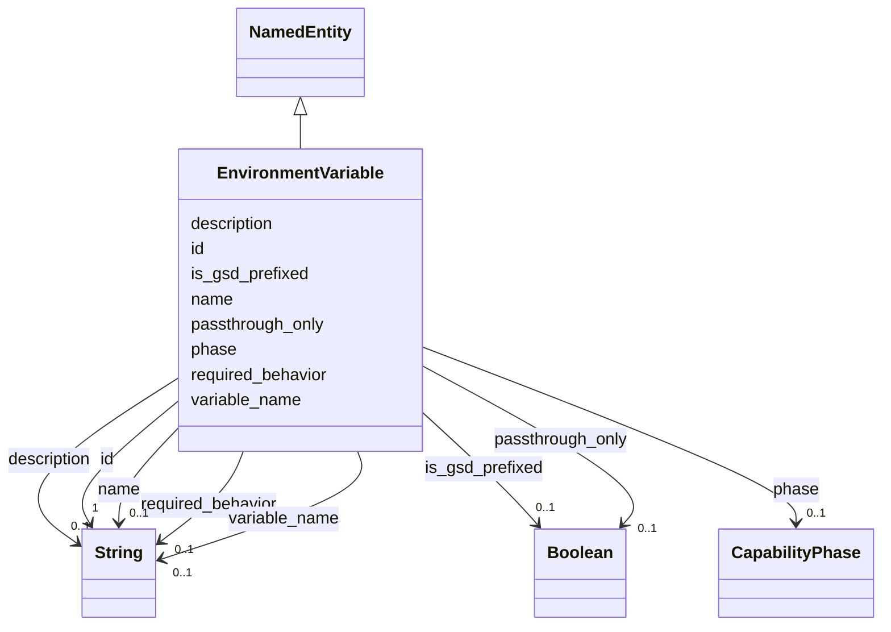

# Class: EnvironmentVariable 


_A configuration or secret key read from the environment._


URI: [gsd:EnvironmentVariable](https://brightforest.dev/schema/gsd_capabilities/EnvironmentVariable)





## Inheritance
* [NamedEntity](NamedEntity.md)
    * **EnvironmentVariable**


## Slots

| Name | Cardinality and Range | Description | Inheritance |
| ---  | --- | --- | --- |
| [variable_name](variable_name.md) | 0..1 <br/> [xsd:string](http://www.w3.org/2001/XMLSchema#string) | Environment variable name (e.g. GSD_SHELL_HOOKS_ENABLED). | direct |
| [phase](phase.md) | 0..1 <br/> [CapabilityPhase](CapabilityPhase.md) | Planning / delivery phase bucket (P0–P5). | direct |
| [required_behavior](required_behavior.md) | 0..1 <br/> [xsd:string](http://www.w3.org/2001/XMLSchema#string) | Expected semantics when set, unset, or invalid. | direct |
| [is_gsd_prefixed](is_gsd_prefixed.md) | 0..1 <br/> [xsd:boolean](http://www.w3.org/2001/XMLSchema#boolean) | True when the name starts with GSD_. | direct |
| [passthrough_only](passthrough_only.md) | 0..1 <br/> [xsd:boolean](http://www.w3.org/2001/XMLSchema#boolean) | True when GSD must not break existing app/studio consumers. | direct |
| [id](id.md) | 1 <br/> [xsd:string](http://www.w3.org/2001/XMLSchema#string) | Stable URI or CURIE-style id for the instance. | [NamedEntity](NamedEntity.md) |
| [name](name.md) | 0..1 <br/> [xsd:string](http://www.w3.org/2001/XMLSchema#string) | Short human-readable name. | [NamedEntity](NamedEntity.md) |
| [description](description.md) | 0..1 <br/> [xsd:string](http://www.w3.org/2001/XMLSchema#string) | Longer prose description. | [NamedEntity](NamedEntity.md) |


## Usages

| used by | used in | type | used |
| ---  | --- | --- | --- |
| [Capability](Capability.md) | [related_env_vars](related_env_vars.md) | range | [EnvironmentVariable](EnvironmentVariable.md) |


## Identifier and Mapping Information


### Schema Source


* from schema: https://brightforest.dev/schema/gsd_capabilities


## Mappings

| Mapping Type | Mapped Value |
| ---  | ---  |
| self | gsd:EnvironmentVariable |
| native | gsd:EnvironmentVariable |


## LinkML Source

<!-- TODO: investigate https://stackoverflow.com/questions/37606292/how-to-create-tabbed-code-blocks-in-mkdocs-or-sphinx -->

### Direct

<details>
```yaml
name: EnvironmentVariable
description: A configuration or secret key read from the environment.
from_schema: https://brightforest.dev/schema/gsd_capabilities
is_a: NamedEntity
slots:
- variable_name
- phase
- required_behavior
- is_gsd_prefixed
- passthrough_only

```
</details>

### Induced

<details>
```yaml
name: EnvironmentVariable
description: A configuration or secret key read from the environment.
from_schema: https://brightforest.dev/schema/gsd_capabilities
is_a: NamedEntity
attributes:
  variable_name:
    name: variable_name
    description: Environment variable name (e.g. GSD_SHELL_HOOKS_ENABLED).
    from_schema: https://brightforest.dev/schema/gsd_capabilities
    rank: 1000
    alias: variable_name
    owner: EnvironmentVariable
    domain_of:
    - EnvironmentVariable
    range: string
    pattern: ^[A-Z][A-Z0-9_]*$
  phase:
    name: phase
    description: Planning / delivery phase bucket (P0–P5).
    from_schema: https://brightforest.dev/schema/gsd_capabilities
    rank: 1000
    alias: phase
    owner: EnvironmentVariable
    domain_of:
    - Capability
    - EnvironmentVariable
    range: CapabilityPhase
  required_behavior:
    name: required_behavior
    description: Expected semantics when set, unset, or invalid.
    from_schema: https://brightforest.dev/schema/gsd_capabilities
    rank: 1000
    alias: required_behavior
    owner: EnvironmentVariable
    domain_of:
    - EnvironmentVariable
    range: string
  is_gsd_prefixed:
    name: is_gsd_prefixed
    description: True when the name starts with GSD_.
    from_schema: https://brightforest.dev/schema/gsd_capabilities
    rank: 1000
    alias: is_gsd_prefixed
    owner: EnvironmentVariable
    domain_of:
    - EnvironmentVariable
    range: boolean
  passthrough_only:
    name: passthrough_only
    description: True when GSD must not break existing app/studio consumers.
    from_schema: https://brightforest.dev/schema/gsd_capabilities
    rank: 1000
    alias: passthrough_only
    owner: EnvironmentVariable
    domain_of:
    - EnvironmentVariable
    range: boolean
  id:
    name: id
    description: Stable URI or CURIE-style id for the instance.
    from_schema: https://brightforest.dev/schema/gsd_capabilities
    rank: 1000
    identifier: true
    alias: id
    owner: EnvironmentVariable
    domain_of:
    - NamedEntity
    range: string
    required: true
  name:
    name: name
    description: Short human-readable name.
    from_schema: https://brightforest.dev/schema/gsd_capabilities
    rank: 1000
    alias: name
    owner: EnvironmentVariable
    domain_of:
    - NamedEntity
    range: string
  description:
    name: description
    description: Longer prose description.
    from_schema: https://brightforest.dev/schema/gsd_capabilities
    rank: 1000
    alias: description
    owner: EnvironmentVariable
    domain_of:
    - NamedEntity
    range: string

```
</details>