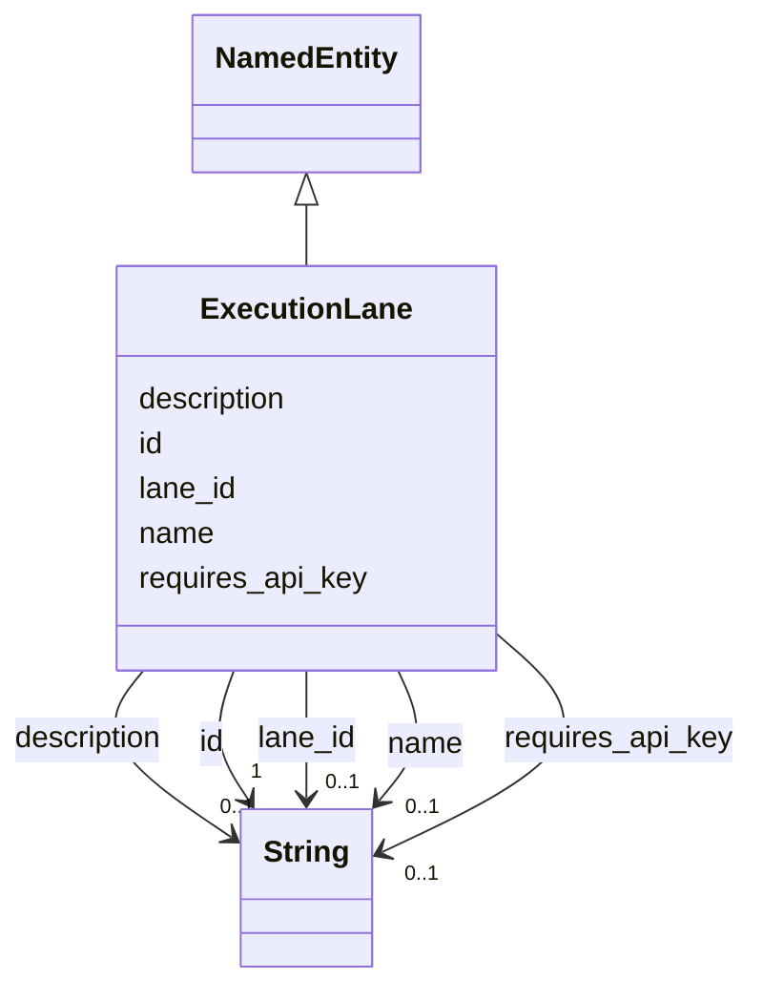

# Class: ExecutionLane 


_Where delegated work runs (local, Docker, E2B, etc.)._


URI: [gsd:ExecutionLane](https://brightforest.dev/schema/gsd_capabilities/ExecutionLane)





## Inheritance
* [NamedEntity](NamedEntity.md)
    * **ExecutionLane**


## Slots

| Name | Cardinality and Range | Description | Inheritance |
| ---  | --- | --- | --- |
| [lane_id](lane_id.md) | 0..1 <br/> [xsd:string](http://www.w3.org/2001/XMLSchema#string) | Identifier for isolation lane (docker, e2b, overlay). | direct |
| [requires_api_key](requires_api_key.md) | 0..1 <br/> [xsd:string](http://www.w3.org/2001/XMLSchema#string) | Env var name required for this lane, if any. | direct |
| [id](id.md) | 1 <br/> [xsd:string](http://www.w3.org/2001/XMLSchema#string) | Stable URI or CURIE-style id for the instance. | [NamedEntity](NamedEntity.md) |
| [name](name.md) | 0..1 <br/> [xsd:string](http://www.w3.org/2001/XMLSchema#string) | Short human-readable name. | [NamedEntity](NamedEntity.md) |
| [description](description.md) | 0..1 <br/> [xsd:string](http://www.w3.org/2001/XMLSchema#string) | Longer prose description. | [NamedEntity](NamedEntity.md) |


## Identifier and Mapping Information


### Schema Source


* from schema: https://brightforest.dev/schema/gsd_capabilities


## Mappings

| Mapping Type | Mapped Value |
| ---  | ---  |
| self | gsd:ExecutionLane |
| native | gsd:ExecutionLane |


## LinkML Source

<!-- TODO: investigate https://stackoverflow.com/questions/37606292/how-to-create-tabbed-code-blocks-in-mkdocs-or-sphinx -->

### Direct

<details>
```yaml
name: ExecutionLane
description: Where delegated work runs (local, Docker, E2B, etc.).
from_schema: https://brightforest.dev/schema/gsd_capabilities
is_a: NamedEntity
slots:
- lane_id
- requires_api_key

```
</details>

### Induced

<details>
```yaml
name: ExecutionLane
description: Where delegated work runs (local, Docker, E2B, etc.).
from_schema: https://brightforest.dev/schema/gsd_capabilities
is_a: NamedEntity
attributes:
  lane_id:
    name: lane_id
    description: Identifier for isolation lane (docker, e2b, overlay).
    from_schema: https://brightforest.dev/schema/gsd_capabilities
    rank: 1000
    alias: lane_id
    owner: ExecutionLane
    domain_of:
    - ExecutionLane
    range: string
  requires_api_key:
    name: requires_api_key
    description: Env var name required for this lane, if any.
    from_schema: https://brightforest.dev/schema/gsd_capabilities
    rank: 1000
    alias: requires_api_key
    owner: ExecutionLane
    domain_of:
    - ExecutionLane
    range: string
  id:
    name: id
    description: Stable URI or CURIE-style id for the instance.
    from_schema: https://brightforest.dev/schema/gsd_capabilities
    rank: 1000
    identifier: true
    alias: id
    owner: ExecutionLane
    domain_of:
    - NamedEntity
    range: string
    required: true
  name:
    name: name
    description: Short human-readable name.
    from_schema: https://brightforest.dev/schema/gsd_capabilities
    rank: 1000
    alias: name
    owner: ExecutionLane
    domain_of:
    - NamedEntity
    range: string
  description:
    name: description
    description: Longer prose description.
    from_schema: https://brightforest.dev/schema/gsd_capabilities
    rank: 1000
    alias: description
    owner: ExecutionLane
    domain_of:
    - NamedEntity
    range: string

```
</details>