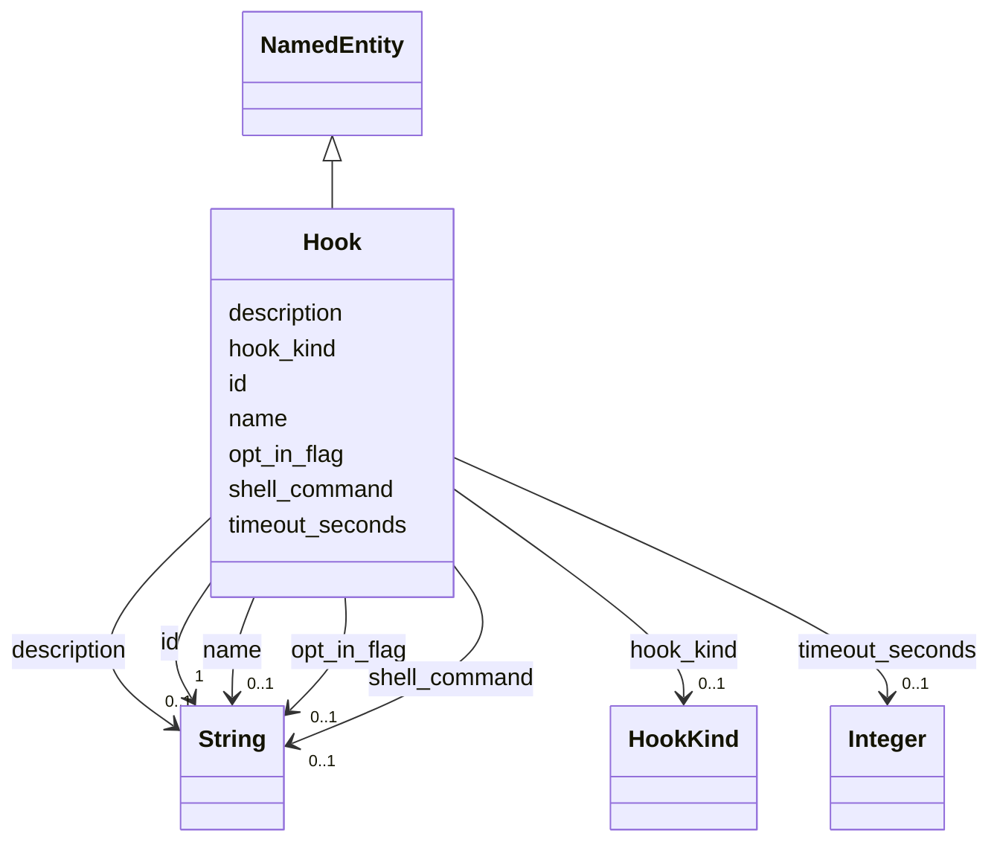

# Class: Hook 


_A user-defined pipeline step (e.g. post-unit, shell run hook)._


URI: [gsd:Hook](https://brightforest.dev/schema/gsd_capabilities/Hook)





## Inheritance
* [NamedEntity](NamedEntity.md)
    * **Hook**


## Slots

| Name | Cardinality and Range | Description | Inheritance |
| ---  | --- | --- | --- |
| [hook_kind](hook_kind.md) | 0..1 <br/> [HookKind](HookKind.md) | Classification of hook (prompt-only vs shell run, etc.). | direct |
| [shell_command](shell_command.md) | 0..1 <br/> [xsd:string](http://www.w3.org/2001/XMLSchema#string) | Executable line for run-type hooks. | direct |
| [timeout_seconds](timeout_seconds.md) | 0..1 <br/> [xsd:integer](http://www.w3.org/2001/XMLSchema#integer) | Upper bound on hook execution time. | direct |
| [opt_in_flag](opt_in_flag.md) | 0..1 <br/> [xsd:string](http://www.w3.org/2001/XMLSchema#string) | Env var or pref that must be truthy before dangerous hooks run. | direct |
| [id](id.md) | 1 <br/> [xsd:string](http://www.w3.org/2001/XMLSchema#string) | Stable URI or CURIE-style id for the instance. | [NamedEntity](NamedEntity.md) |
| [name](name.md) | 0..1 <br/> [xsd:string](http://www.w3.org/2001/XMLSchema#string) | Short human-readable name. | [NamedEntity](NamedEntity.md) |
| [description](description.md) | 0..1 <br/> [xsd:string](http://www.w3.org/2001/XMLSchema#string) | Longer prose description. | [NamedEntity](NamedEntity.md) |


## Identifier and Mapping Information


### Schema Source


* from schema: https://brightforest.dev/schema/gsd_capabilities


## Mappings

| Mapping Type | Mapped Value |
| ---  | ---  |
| self | gsd:Hook |
| native | gsd:Hook |


## LinkML Source

<!-- TODO: investigate https://stackoverflow.com/questions/37606292/how-to-create-tabbed-code-blocks-in-mkdocs-or-sphinx -->

### Direct

<details>
```yaml
name: Hook
description: A user-defined pipeline step (e.g. post-unit, shell run hook).
from_schema: https://brightforest.dev/schema/gsd_capabilities
is_a: NamedEntity
slots:
- hook_kind
- shell_command
- timeout_seconds
- opt_in_flag

```
</details>

### Induced

<details>
```yaml
name: Hook
description: A user-defined pipeline step (e.g. post-unit, shell run hook).
from_schema: https://brightforest.dev/schema/gsd_capabilities
is_a: NamedEntity
attributes:
  hook_kind:
    name: hook_kind
    description: Classification of hook (prompt-only vs shell run, etc.).
    from_schema: https://brightforest.dev/schema/gsd_capabilities
    rank: 1000
    alias: hook_kind
    owner: Hook
    domain_of:
    - Hook
    range: HookKind
  shell_command:
    name: shell_command
    description: Executable line for run-type hooks.
    from_schema: https://brightforest.dev/schema/gsd_capabilities
    rank: 1000
    alias: shell_command
    owner: Hook
    domain_of:
    - Hook
    range: string
  timeout_seconds:
    name: timeout_seconds
    description: Upper bound on hook execution time.
    from_schema: https://brightforest.dev/schema/gsd_capabilities
    rank: 1000
    alias: timeout_seconds
    owner: Hook
    domain_of:
    - Hook
    range: integer
    minimum_value: 1
  opt_in_flag:
    name: opt_in_flag
    description: Env var or pref that must be truthy before dangerous hooks run.
    from_schema: https://brightforest.dev/schema/gsd_capabilities
    rank: 1000
    alias: opt_in_flag
    owner: Hook
    domain_of:
    - Hook
    range: string
  id:
    name: id
    description: Stable URI or CURIE-style id for the instance.
    from_schema: https://brightforest.dev/schema/gsd_capabilities
    rank: 1000
    identifier: true
    alias: id
    owner: Hook
    domain_of:
    - NamedEntity
    range: string
    required: true
  name:
    name: name
    description: Short human-readable name.
    from_schema: https://brightforest.dev/schema/gsd_capabilities
    rank: 1000
    alias: name
    owner: Hook
    domain_of:
    - NamedEntity
    range: string
  description:
    name: description
    description: Longer prose description.
    from_schema: https://brightforest.dev/schema/gsd_capabilities
    rank: 1000
    alias: description
    owner: Hook
    domain_of:
    - NamedEntity
    range: string

```
</details>