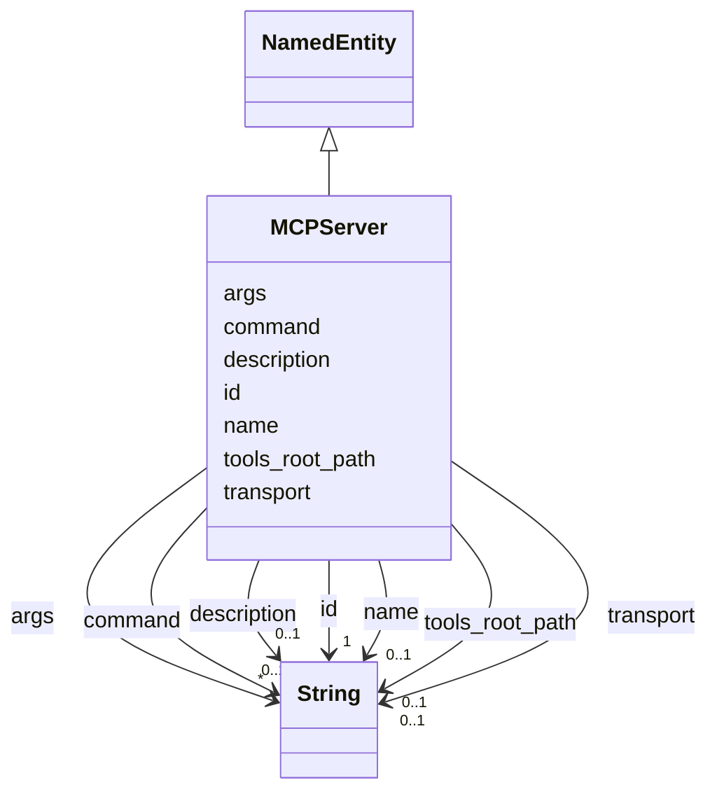

# Class: MCPServer 


_A Model Context Protocol server configuration or candidate._


URI: [gsd:MCPServer](https://brightforest.dev/schema/gsd_capabilities/MCPServer)





## Inheritance
* [NamedEntity](NamedEntity.md)
    * **MCPServer**


## Slots

| Name | Cardinality and Range | Description | Inheritance |
| ---  | --- | --- | --- |
| [transport](transport.md) | 0..1 <br/> [xsd:string](http://www.w3.org/2001/XMLSchema#string) | MCP transport (e.g. stdio, sse). | direct |
| [command](command.md) | 0..1 <br/> [xsd:string](http://www.w3.org/2001/XMLSchema#string) | Server launch command. | direct |
| [args](args.md) | * <br/> [xsd:string](http://www.w3.org/2001/XMLSchema#string) | Arguments passed to the MCP server command. | direct |
| [tools_root_path](tools_root_path.md) | 0..1 <br/> [xsd:string](http://www.w3.org/2001/XMLSchema#string) | Filesystem root for bootstrap materialization (e.g. GSD_MCP_TOOLS_ROOT). | direct |
| [id](id.md) | 1 <br/> [xsd:string](http://www.w3.org/2001/XMLSchema#string) | Stable URI or CURIE-style id for the instance. | [NamedEntity](NamedEntity.md) |
| [name](name.md) | 0..1 <br/> [xsd:string](http://www.w3.org/2001/XMLSchema#string) | Short human-readable name. | [NamedEntity](NamedEntity.md) |
| [description](description.md) | 0..1 <br/> [xsd:string](http://www.w3.org/2001/XMLSchema#string) | Longer prose description. | [NamedEntity](NamedEntity.md) |


## Usages

| used by | used in | type | used |
| ---  | --- | --- | --- |
| [ResearchArtifact](ResearchArtifact.md) | [merged_mcp_server](merged_mcp_server.md) | range | [MCPServer](MCPServer.md) |


## Identifier and Mapping Information


### Schema Source


* from schema: https://brightforest.dev/schema/gsd_capabilities


## Mappings

| Mapping Type | Mapped Value |
| ---  | ---  |
| self | gsd:MCPServer |
| native | gsd:MCPServer |


## LinkML Source

<!-- TODO: investigate https://stackoverflow.com/questions/37606292/how-to-create-tabbed-code-blocks-in-mkdocs-or-sphinx -->

### Direct

<details>
```yaml
name: MCPServer
description: A Model Context Protocol server configuration or candidate.
from_schema: https://brightforest.dev/schema/gsd_capabilities
is_a: NamedEntity
slots:
- transport
- command
- args
- tools_root_path

```
</details>

### Induced

<details>
```yaml
name: MCPServer
description: A Model Context Protocol server configuration or candidate.
from_schema: https://brightforest.dev/schema/gsd_capabilities
is_a: NamedEntity
attributes:
  transport:
    name: transport
    description: MCP transport (e.g. stdio, sse).
    from_schema: https://brightforest.dev/schema/gsd_capabilities
    rank: 1000
    alias: transport
    owner: MCPServer
    domain_of:
    - MCPServer
    range: string
  command:
    name: command
    description: Server launch command.
    from_schema: https://brightforest.dev/schema/gsd_capabilities
    rank: 1000
    alias: command
    owner: MCPServer
    domain_of:
    - MCPServer
    range: string
  args:
    name: args
    description: Arguments passed to the MCP server command.
    from_schema: https://brightforest.dev/schema/gsd_capabilities
    rank: 1000
    alias: args
    owner: MCPServer
    domain_of:
    - MCPServer
    range: string
    multivalued: true
    inlined: true
    inlined_as_list: true
  tools_root_path:
    name: tools_root_path
    description: Filesystem root for bootstrap materialization (e.g. GSD_MCP_TOOLS_ROOT).
    from_schema: https://brightforest.dev/schema/gsd_capabilities
    rank: 1000
    alias: tools_root_path
    owner: MCPServer
    domain_of:
    - MCPServer
    range: string
  id:
    name: id
    description: Stable URI or CURIE-style id for the instance.
    from_schema: https://brightforest.dev/schema/gsd_capabilities
    rank: 1000
    identifier: true
    alias: id
    owner: MCPServer
    domain_of:
    - NamedEntity
    range: string
    required: true
  name:
    name: name
    description: Short human-readable name.
    from_schema: https://brightforest.dev/schema/gsd_capabilities
    rank: 1000
    alias: name
    owner: MCPServer
    domain_of:
    - NamedEntity
    range: string
  description:
    name: description
    description: Longer prose description.
    from_schema: https://brightforest.dev/schema/gsd_capabilities
    rank: 1000
    alias: description
    owner: MCPServer
    domain_of:
    - NamedEntity
    range: string

```
</details>