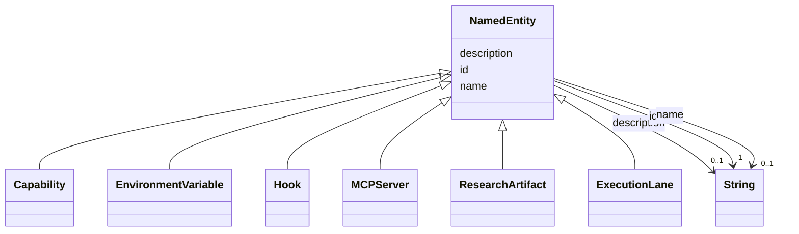

# Class: NamedEntity 


_Anything with a stable identifier and human label._


* __NOTE__: this is an abstract class and should not be instantiated directly


URI: [gsd:NamedEntity](https://brightforest.dev/schema/gsd_capabilities/NamedEntity)





## Inheritance
* **NamedEntity**
    * [Capability](Capability.md)
    * [EnvironmentVariable](EnvironmentVariable.md)
    * [Hook](Hook.md)
    * [MCPServer](MCPServer.md)
    * [ResearchArtifact](ResearchArtifact.md)
    * [ExecutionLane](ExecutionLane.md)


## Slots

| Name | Cardinality and Range | Description | Inheritance |
| ---  | --- | --- | --- |
| [id](id.md) | 1 <br/> [xsd:string](http://www.w3.org/2001/XMLSchema#string) | Stable URI or CURIE-style id for the instance. | direct |
| [name](name.md) | 0..1 <br/> [xsd:string](http://www.w3.org/2001/XMLSchema#string) | Short human-readable name. | direct |
| [description](description.md) | 0..1 <br/> [xsd:string](http://www.w3.org/2001/XMLSchema#string) | Longer prose description. | direct |


## Identifier and Mapping Information


### Schema Source


* from schema: https://brightforest.dev/schema/gsd_capabilities


## Mappings

| Mapping Type | Mapped Value |
| ---  | ---  |
| self | gsd:NamedEntity |
| native | gsd:NamedEntity |


## LinkML Source

<!-- TODO: investigate https://stackoverflow.com/questions/37606292/how-to-create-tabbed-code-blocks-in-mkdocs-or-sphinx -->

### Direct

<details>
```yaml
name: NamedEntity
description: Anything with a stable identifier and human label.
from_schema: https://brightforest.dev/schema/gsd_capabilities
abstract: true
slots:
- id
- name
- description

```
</details>

### Induced

<details>
```yaml
name: NamedEntity
description: Anything with a stable identifier and human label.
from_schema: https://brightforest.dev/schema/gsd_capabilities
abstract: true
attributes:
  id:
    name: id
    description: Stable URI or CURIE-style id for the instance.
    from_schema: https://brightforest.dev/schema/gsd_capabilities
    rank: 1000
    identifier: true
    alias: id
    owner: NamedEntity
    domain_of:
    - NamedEntity
    range: string
  name:
    name: name
    description: Short human-readable name.
    from_schema: https://brightforest.dev/schema/gsd_capabilities
    rank: 1000
    alias: name
    owner: NamedEntity
    domain_of:
    - NamedEntity
    range: string
  description:
    name: description
    description: Longer prose description.
    from_schema: https://brightforest.dev/schema/gsd_capabilities
    rank: 1000
    alias: description
    owner: NamedEntity
    domain_of:
    - NamedEntity
    range: string

```
</details>