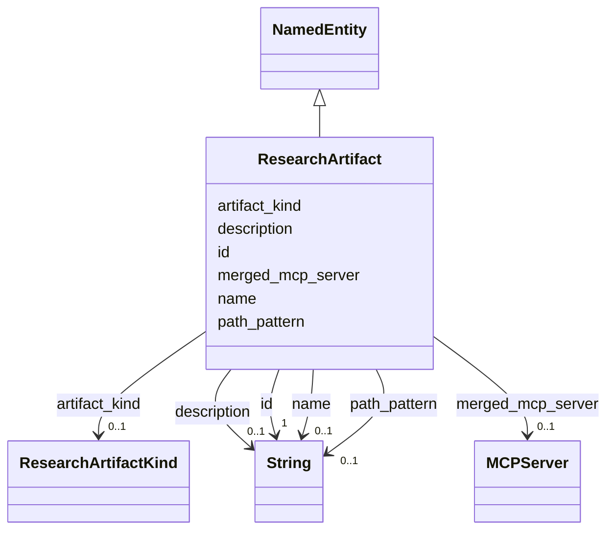

# Class: ResearchArtifact 


_Output from research dispatch (milestone or slice research doc)._


URI: [gsd:ResearchArtifact](https://brightforest.dev/schema/gsd_capabilities/ResearchArtifact)





## Inheritance
* [NamedEntity](NamedEntity.md)
    * **ResearchArtifact**


## Slots

| Name | Cardinality and Range | Description | Inheritance |
| ---  | --- | --- | --- |
| [artifact_kind](artifact_kind.md) | 0..1 <br/> [ResearchArtifactKind](ResearchArtifactKind.md) | Milestone vs slice research output. | direct |
| [path_pattern](path_pattern.md) | 0..1 <br/> [xsd:string](http://www.w3.org/2001/XMLSchema#string) | Filename or glob pattern (e.g. M*-RESEARCH.md). | direct |
| [merged_mcp_server](merged_mcp_server.md) | 0..1 <br/> [MCPServer](MCPServer.md) | Optional MCP server whose output is merged into the artifact. | direct |
| [id](id.md) | 1 <br/> [xsd:string](http://www.w3.org/2001/XMLSchema#string) | Stable URI or CURIE-style id for the instance. | [NamedEntity](NamedEntity.md) |
| [name](name.md) | 0..1 <br/> [xsd:string](http://www.w3.org/2001/XMLSchema#string) | Short human-readable name. | [NamedEntity](NamedEntity.md) |
| [description](description.md) | 0..1 <br/> [xsd:string](http://www.w3.org/2001/XMLSchema#string) | Longer prose description. | [NamedEntity](NamedEntity.md) |


## Identifier and Mapping Information


### Schema Source


* from schema: https://brightforest.dev/schema/gsd_capabilities


## Mappings

| Mapping Type | Mapped Value |
| ---  | ---  |
| self | gsd:ResearchArtifact |
| native | gsd:ResearchArtifact |


## LinkML Source

<!-- TODO: investigate https://stackoverflow.com/questions/37606292/how-to-create-tabbed-code-blocks-in-mkdocs-or-sphinx -->

### Direct

<details>
```yaml
name: ResearchArtifact
description: Output from research dispatch (milestone or slice research doc).
from_schema: https://brightforest.dev/schema/gsd_capabilities
is_a: NamedEntity
slots:
- artifact_kind
- path_pattern
- merged_mcp_server

```
</details>

### Induced

<details>
```yaml
name: ResearchArtifact
description: Output from research dispatch (milestone or slice research doc).
from_schema: https://brightforest.dev/schema/gsd_capabilities
is_a: NamedEntity
attributes:
  artifact_kind:
    name: artifact_kind
    description: Milestone vs slice research output.
    from_schema: https://brightforest.dev/schema/gsd_capabilities
    rank: 1000
    alias: artifact_kind
    owner: ResearchArtifact
    domain_of:
    - ResearchArtifact
    range: ResearchArtifactKind
  path_pattern:
    name: path_pattern
    description: Filename or glob pattern (e.g. M*-RESEARCH.md).
    from_schema: https://brightforest.dev/schema/gsd_capabilities
    rank: 1000
    alias: path_pattern
    owner: ResearchArtifact
    domain_of:
    - ResearchArtifact
    range: string
  merged_mcp_server:
    name: merged_mcp_server
    description: Optional MCP server whose output is merged into the artifact.
    from_schema: https://brightforest.dev/schema/gsd_capabilities
    rank: 1000
    alias: merged_mcp_server
    owner: ResearchArtifact
    domain_of:
    - ResearchArtifact
    range: MCPServer
  id:
    name: id
    description: Stable URI or CURIE-style id for the instance.
    from_schema: https://brightforest.dev/schema/gsd_capabilities
    rank: 1000
    identifier: true
    alias: id
    owner: ResearchArtifact
    domain_of:
    - NamedEntity
    range: string
    required: true
  name:
    name: name
    description: Short human-readable name.
    from_schema: https://brightforest.dev/schema/gsd_capabilities
    rank: 1000
    alias: name
    owner: ResearchArtifact
    domain_of:
    - NamedEntity
    range: string
  description:
    name: description
    description: Longer prose description.
    from_schema: https://brightforest.dev/schema/gsd_capabilities
    rank: 1000
    alias: description
    owner: ResearchArtifact
    domain_of:
    - NamedEntity
    range: string

```
</details>